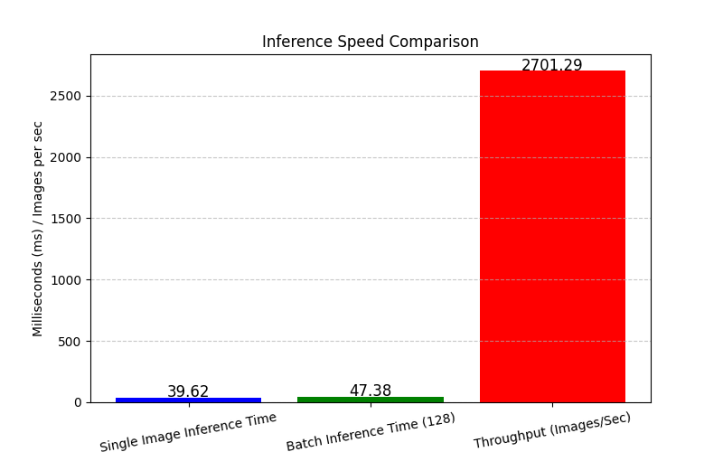

# Machine-Learning: Real-Time-Object-Classification
Application of machine learning models to recognise objects from the [CIFAR-10]() dataset. This work uses the [TensorFlow]() framework to build, train, and deploy models to produce real-time object classifications.

>[!NOTE]
>
>## Realtime Preview
><details>
> 
> 
></details>

## Visualisations
<p align="center">
    <table>
        <tr>
            <td></td>
            <td></td>
        </tr>
        <tr>
            <td colspan="1" align="center"><figcaption>Batch Normalised Model Confusion Matrix</figcaption></td>
            <td colspan="1" align="center"><figcaption>Batch Normalised Model Inference Timings with 128 batch size</figcaption></td>
        </tr>
    </table>
</p>

## TensorFlow Setup
This project utilises the TensorFlow framework to create and train machine learning models. Please ensure that the TensorFlow is properly installed on your system. Please refer to the [TensorFlow documentation](https://www.tensorflow.org/install).

> [!Important]\
> This work is compatible to run on both `CPU` and `GPU`. To improve performance, it is advised to use the `GPU` for training models. Please ensure that the `GPU` drivers are up to date and the necessary development toolkits are installed on your system. For NVIDIA GPUs, please install the [CUDA Toolkit](https://developer.nvidia.com/cuda-downloads) and [cuDNN SDK](https://developer.nvidia.com/cudnn).

## Getting Started
To run the application, run the following commands.

### Linux / WSL2
Create a Python virtual environment
```shell
python -m venv .venv
. .venv/bin/activate
pip install -r requirements.txt
python RealtimeClassification.py
```